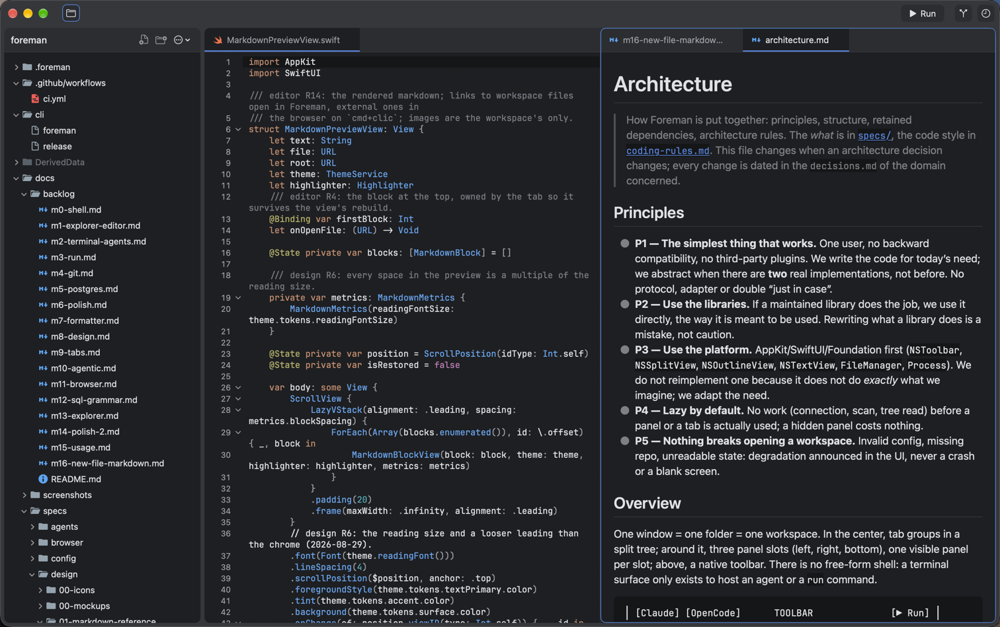
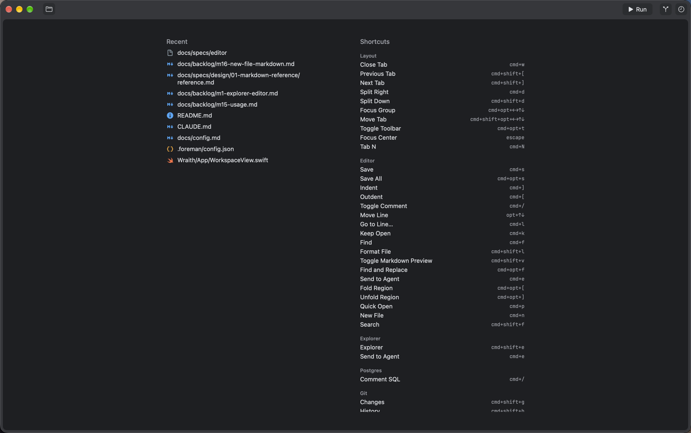
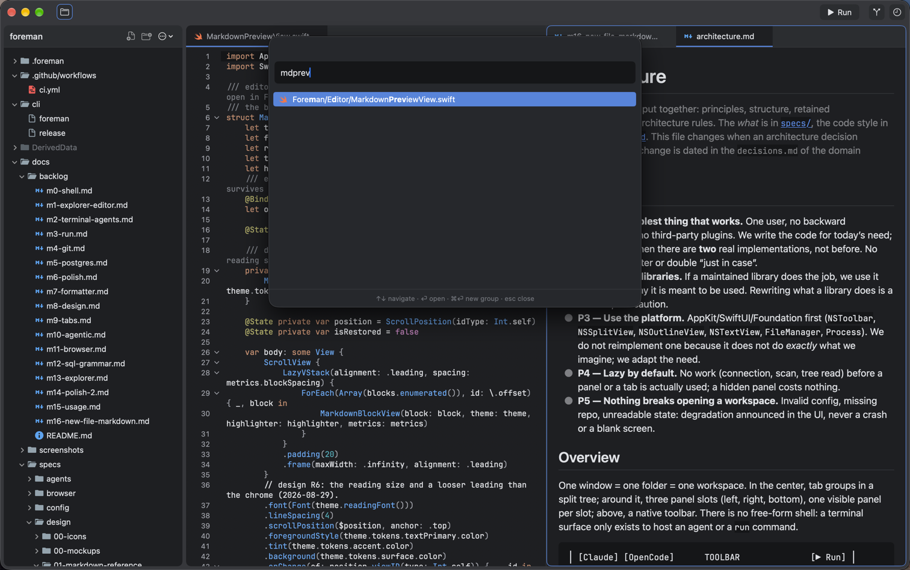
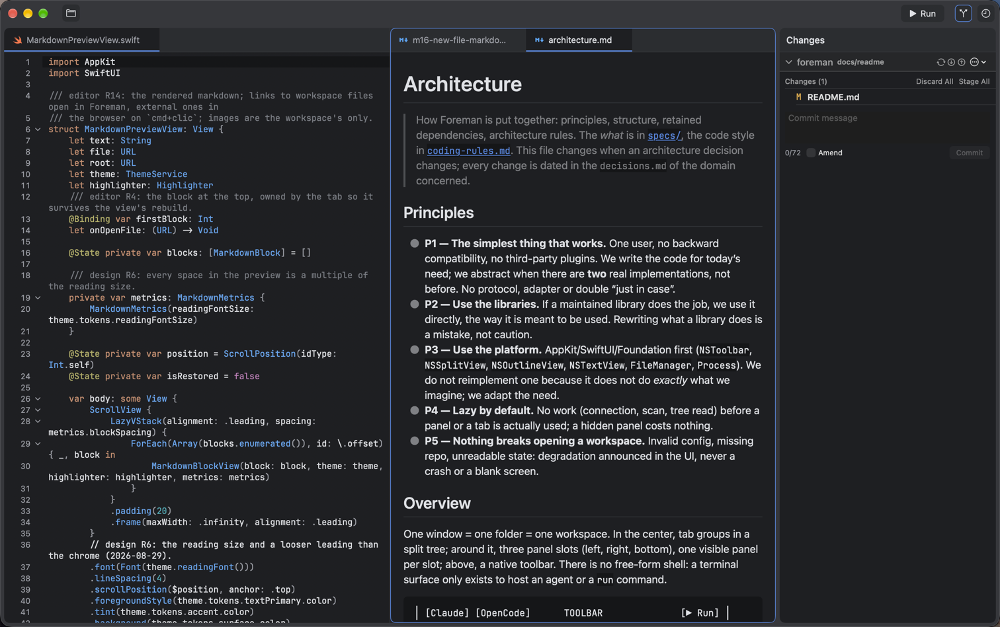

# Foreman 👷

**An agentic workspace for macOS.** One window is one folder is one workspace — like an IDE, except
the centre of it is your CLI agents.



## What it is

Foreman is a native macOS app, written in Swift 6 with SwiftUI and AppKit. Your CLI agents (Claude
Code, Antigravity, OpenCode…) each run in their own tab on an embedded terminal surface
([SwiftTerm](https://github.com/migueldeicaza/SwiftTerm)), one click away in the toolbar. There is
**no free-form shell**: a terminal surface only exists to host an agent or a `run` command.
Everything else is a feature that attaches panels and tabs around that centre.

| | |
|---|---|
| **Explorer** | Lazy file tree on `NSOutlineView`, refreshed by FSEvents, git badges, drag and drop, single-child folders folded into one row |
| **Editor** | `NSTextView` on TextKit 2, tree-sitter highlighting through [Neon](https://github.com/ChimeHQ/Neon), gutter, code folding, formatters, `cmd+p` fuzzy quick open, `cmd+shift+f` search through `rg` |
| **Markdown** | Rendered from [swift-markdown](https://github.com/apple/swift-markdown), measured construct by construct [against GitHub's](docs/specs/design/01-markdown-vs-github.md) |
| **Agents** | One tab per agent, a toolbar button each, `cmd+e` sends the current file, selection or diff as `@path` |
| **Git** | Changes and history panels, side-by-side diff tabs, stage, commit, branches, stash, worktrees — through the `git` binary, so your config, hooks and signing all apply |
| **Run** | Workspace commands from `config.json` or detected from the project, `cmd+r` palette, ▶ Run button |
| **Postgres** | Schema browser, query tabs with a SQL editor, result grid, history |
| **Browser** | One tab on the page you serve, private session, Web Inspector, phone/tablet/desktop viewports |

Personal project, Apple Silicon, local use. Built end to end by AI agents — see
[`AGENTS.md`](AGENTS.md).

## A few more screens

The empty group is a home screen: recent files on the left, **every** shortcut the app knows on the
right, each row clickable. It is generated from the shortcut registry, so it cannot drift from what
the keys actually do.



`cmd+p` is a fuzzy quick open over the whole workspace — `mdprev` finds `MarkdownPreviewView.swift`.



The Changes panel is a tree of what git reports — here, this README being rewritten. A click on a
row opens the file's diff in a centre tab, and the commit box is right below it.



## Building and running

Xcode 27 (the project is format 110) and macOS 26.

```bash
git clone git@github.com:abachar/foreman.git
cd foreman
open Foreman.xcodeproj              # build & run
ln -s "$PWD/cli/foreman" /usr/local/bin/foreman
foreman .                           # opens a folder in the built app
```

From the command line, if you prefer:

```bash
xcodebuild build -scheme Foreman -destination 'platform=macOS' \
  CODE_SIGNING_ALLOWED=NO -skipPackagePluginValidation -derivedDataPath DerivedData
```

## Installing locally

```bash
cli/release   # Release archive → /Applications/Foreman.app (unsigned: macOS asks once at first launch)
foreman .
```

That is the whole distribution (`product` R10): no signing, notarization, Homebrew tap or
auto-update — one user, one machine (decision 2026-08-27).

## Configuring

A workspace is configured by `.foreman/config.json` at its root, merged under a global
`~/.config/foreman/config.json`. Each feature reads its own section; every key is listed in
[`docs/config.md`](docs/config.md).

```json
{
  "agents": { "claude": { "command": "claude" } },
  "commands": { "root": { "build": "swift build", "test": "swift test" } },
  "shortcuts": { "agents.claude": "cmd+shift+a" },
  "theme": { "accent": "#4C8DF6", "readingFontSize": 16 }
}
```

It is hot-reloaded: save the file and the app follows. An invalid file keeps the last valid version
and says so in a banner rather than falling over.

Every shortcut is in [`docs/shortcuts.md`](docs/shortcuts.md) and can be overridden through
`shortcuts`. A conflict is reported, never resolved silently.

## How it is built

Specs, studies and decisions live in [`docs/specs/`](docs/specs/), one folder per domain — what to
build (`00-study.md`), what was decided and why (`decisions.md`), what is still open
(`questions.md`). The milestone-by-milestone backlog and its progress are in
[`docs/backlog/`](docs/backlog/README.md). How the app is assembled — principles, structure,
dependencies — is [`docs/architecture.md`](docs/architecture.md); how the code is written is
[`docs/coding-rules.md`](docs/coding-rules.md).

Read those before touching the code: no code for a domain without its study, and a behaviour change
updates its spec in the same commit.
